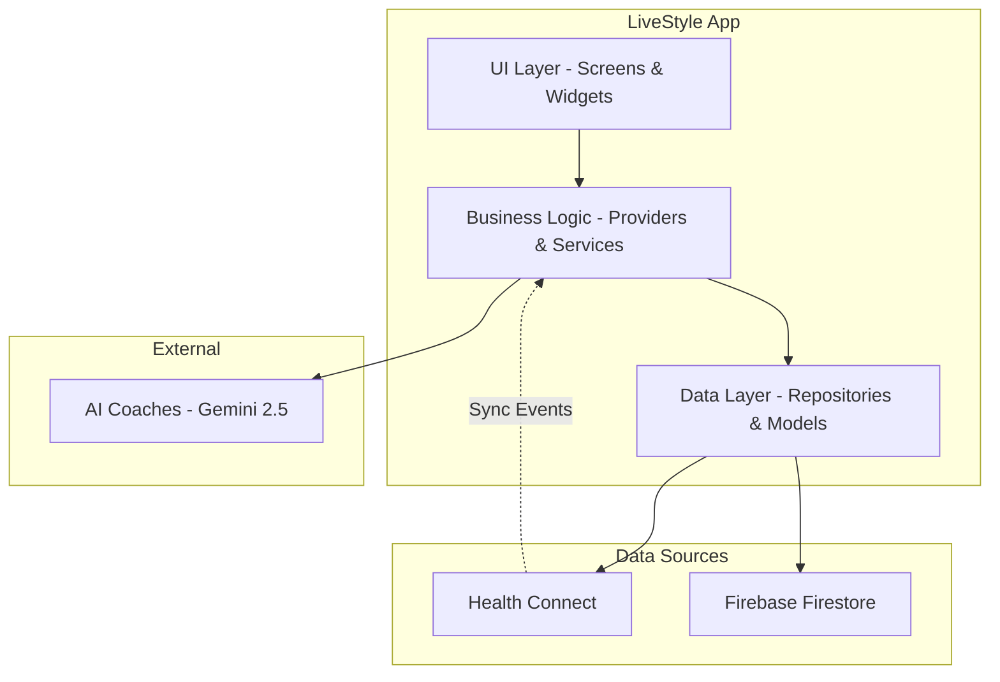
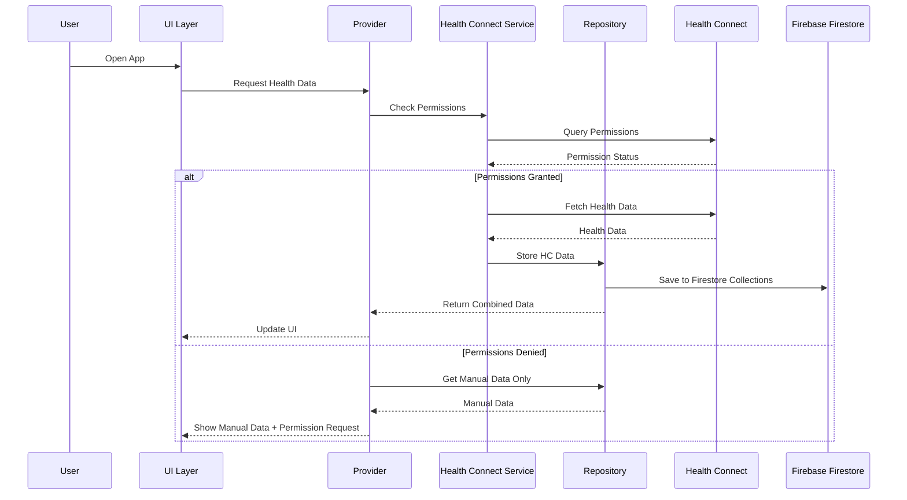

# Health Connect Integration Design Document

## Overview

This design document outlines the integration of Google Health Connect data into the LiveStyle Flutter application. The integration will provide users with seamless synchronization of health and fitness data including weight, body composition, workout sessions, and other metrics from the centralized Health Connect platform on Android devices.

**Platform Support**: Health Connect integration is available exclusively on Android devices. On iOS, macOS, Web, and other platforms, the application will continue to function normally with manual data entry as the primary input method. The design ensures graceful degradation and consistent user experience across all platforms.

The design follows a clean architecture pattern with clear separation between data sources, business logic, and presentation layers. It implements a dual-data-source approach where Health Connect data and manually entered data coexist independently, allowing users to maintain data integrity while benefiting from automated synchronization on supported platforms.

## Architecture

### High-Level Architecture



### Data Flow Architecture



## Components and Interfaces

### 1. Health Connect Service Layer

#### HealthConnectService
Primary service for managing Health Connect integration:

```dart
abstract class HealthConnectService {
  Future<bool> isAvailable();
  Future<bool> hasPermissions(List<HealthDataType> types);
  Future<bool> requestPermissions(List<HealthDataType> types);
  Future<List<HealthDataPoint>> getHealthData(
    List<HealthDataType> types,
    DateTime startTime,
    DateTime endTime,
  );
  Future<bool> writeHealthData(List<HealthDataPoint> dataPoints);
  Future<void> revokePermissions();
  Stream<HealthConnectEvent> get healthConnectEvents;
  
  // Platform detection
  bool get isPlatformSupported;
}
```

#### HealthConnectServiceImpl
Concrete implementation using the `health` package:

```dart
class HealthConnectServiceImpl implements HealthConnectService {
  final Health _health = Health();
  final StreamController<HealthConnectEvent> _eventController;
  
  @override
  bool get isPlatformSupported => Platform.isAndroid;
  
  @override
  Future<bool> isAvailable() async {
    if (!isPlatformSupported) return false;
    // Check if Health Connect is installed and available on Android
    return await _health.isHealthConnectAvailable();
  }
  
  @override
  Future<bool> hasPermissions(List<HealthDataType> types) async {
    if (!isPlatformSupported) return false;
    // Check current permission status
  }
  
  @override
  Future<List<HealthDataPoint>> getHealthData(
    List<HealthDataType> types,
    DateTime startTime,
    DateTime endTime,
  ) async {
    if (!isPlatformSupported) return [];
    // Fetch data from Health Connect with error handling
  }
}

// Non-Android implementation
class HealthConnectServiceStub implements HealthConnectService {
  @override
  bool get isPlatformSupported => false;
  
  @override
  Future<bool> isAvailable() async => false;
  
  @override
  Future<bool> hasPermissions(List<HealthDataType> types) async => false;
  
  @override
  Future<List<HealthDataPoint>> getHealthData(
    List<HealthDataType> types,
    DateTime startTime,
    DateTime endTime,
  ) async => [];
  
  // ... other methods return appropriate defaults
}
```

### 2. Data Models

#### HealthDataPoint
Unified model for health data from any source:

```dart
class HealthDataPoint {
  final String id;
  final HealthDataType type;
  final double value;
  final String? unit;
  final DateTime timestamp;
  final DateTime? endTime;
  final HealthDataSource source;
  final Map<String, dynamic>? metadata;
  
  const HealthDataPoint({
    required this.id,
    required this.type,
    required this.value,
    this.unit,
    required this.timestamp,
    this.endTime,
    required this.source,
    this.metadata,
  });
}

enum HealthDataSource {
  healthConnect,
  manual,
  imported,
}

enum HealthDataType {
  weight,
  bodyFatPercentage,
  bmi,
  steps,
  heartRate,
  workout,
  calories,
  sleep,
}
```

#### WorkoutSession
Extended model for workout data:

```dart
class WorkoutSession {
  final String id;
  final WorkoutType type;
  final DateTime startTime;
  final DateTime endTime;
  final int? calories;
  final double? distance;
  final List<HeartRateZone>? heartRateZones;
  final HealthDataSource source;
  final Map<String, dynamic>? metadata;
  
  Duration get duration => endTime.difference(startTime);
}
```

### 3. Repository Layer

#### HealthDataRepository
Manages data from multiple sources:

```dart
abstract class HealthDataRepository {
  Future<List<HealthDataPoint>> getHealthData(
    List<HealthDataType> types,
    DateTime startTime,
    DateTime endTime,
    {HealthDataSource? source}
  );
  
  Future<void> saveHealthData(List<HealthDataPoint> dataPoints);
  Future<void> deleteHealthConnectData();
  Future<void> syncHealthConnectData();
  
  Stream<List<HealthDataPoint>> watchHealthData(List<HealthDataType> types);
}
```

#### HealthDataRepositoryImpl
Implementation with dual data source support:

```dart
class HealthDataRepositoryImpl implements HealthDataRepository {
  final HealthConnectService _healthConnectService;
  final FirebaseFirestore _firestore;
  final Logger _logger;
  
  @override
  Future<List<HealthDataPoint>> getHealthData(
    List<HealthDataType> types,
    DateTime startTime,
    DateTime endTime,
    {HealthDataSource? source}
  ) async {
    final userId = FirebaseAuth.instance.currentUser?.uid;
    if (userId == null) throw Exception('User not authenticated');
    
    if (source == HealthDataSource.healthConnect) {
      return _getHealthConnectDataFromFirestore(userId, types, startTime, endTime);
    } else if (source == HealthDataSource.manual) {
      return _getManualDataFromFirestore(userId, types, startTime, endTime);
    } else {
      // Return combined data with source indicators
      final healthConnectData = await _getHealthConnectDataFromFirestore(userId, types, startTime, endTime);
      final manualData = await _getManualDataFromFirestore(userId, types, startTime, endTime);
      return _combineAndSortData(healthConnectData, manualData);
    }
  }
  
  Future<List<HealthDataPoint>> _getHealthConnectDataFromFirestore(
    String userId,
    List<HealthDataType> types,
    DateTime startTime,
    DateTime endTime,
  ) async {
    final query = _firestore
        .collection('users')
        .doc(userId)
        .collection('healthConnectData')
        .where('type', whereIn: types.map((t) => t.name).toList())
        .where('timestamp', isGreaterThanOrEqualTo: Timestamp.fromDate(startTime))
        .where('timestamp', isLessThanOrEqualTo: Timestamp.fromDate(endTime))
        .orderBy('timestamp', descending: true);
    
    final snapshot = await query.get();
    return snapshot.docs.map((doc) => HealthDataPoint.fromFirestore(doc)).toList();
  }
}
```

### 4. Provider Layer (Riverpod)

#### HealthConnectProvider
State management for Health Connect integration:

```dart
@riverpod
class HealthConnectNotifier extends _$HealthConnectNotifier {
  @override
  HealthConnectState build() {
    return const HealthConnectState.initial();
  }
  
  Future<void> checkPermissions() async {
    // Check and update permission status
  }
  
  Future<void> requestPermissions(List<HealthDataType> types) async {
    // Request permissions and handle response
  }
  
  Future<void> syncData() async {
    // Trigger data synchronization
  }
  
  Future<void> resetHealthConnectData() async {
    // Delete and reimport Health Connect data
  }
}

@freezed
class HealthConnectState with _$HealthConnectState {
  const factory HealthConnectState.initial() = _Initial;
  const factory HealthConnectState.loading() = _Loading;
  const factory HealthConnectState.available({
    required Map<HealthDataType, bool> permissions,
    required DateTime? lastSync,
  }) = _Available;
  const factory HealthConnectState.unavailable(String reason) = _Unavailable;
  const factory HealthConnectState.platformNotSupported() = _PlatformNotSupported;
  const factory HealthConnectState.error(String message) = _Error;
}
```

#### Enhanced Health Metrics Provider
Updated to handle dual data sources:

```dart
@riverpod
class HealthMetricsNotifier extends _$HealthMetricsNotifier {
  @override
  Future<HealthMetricsState> build() async {
    return _loadHealthMetrics();
  }
  
  Future<void> refreshData({HealthDataSource? source}) async {
    // Refresh data from specified source or all sources
  }
  
  Future<void> setDataSourcePreference(
    HealthDataType type, 
    HealthDataSource preferredSource
  ) async {
    // Set user preference for data source priority
  }
}
```

### 5. UI Components

#### HealthConnectPermissionScreen
Initial permission request screen:

```dart
class HealthConnectPermissionScreen extends ConsumerWidget {
  @override
  Widget build(BuildContext context, WidgetRef ref) {
    final healthConnectState = ref.watch(healthConnectProvider);
    
    return Scaffold(
      body: SafeArea(
        child: Padding(
          padding: const EdgeInsets.all(24.0),
          child: Column(
            children: [
              _buildHeader(),
              _buildPermissionsList(),
              _buildActionButtons(ref),
              _buildSkipOption(ref),
            ],
          ),
        ),
      ),
    );
  }
}
```

#### HealthConnectSettingsWidget
Settings management for Health Connect:

```dart
class HealthConnectSettingsWidget extends ConsumerWidget {
  @override
  Widget build(BuildContext context, WidgetRef ref) {
    final healthConnectState = ref.watch(healthConnectProvider);
    
    return Card(
      child: Column(
        children: [
          _buildConnectionStatus(healthConnectState),
          _buildPermissionsList(healthConnectState),
          _buildSyncControls(ref),
          _buildDataSourcePreferences(ref),
          _buildResetOption(ref),
        ],
      ),
    );
  }
}
```

#### DataSourceIndicator
Widget to show data source in UI:

```dart
class DataSourceIndicator extends StatelessWidget {
  final HealthDataSource source;
  final bool showIcon;
  
  @override
  Widget build(BuildContext context) {
    return Container(
      padding: const EdgeInsets.symmetric(horizontal: 8, vertical: 4),
      decoration: BoxDecoration(
        color: _getSourceColor(source),
        borderRadius: BorderRadius.circular(12),
      ),
      child: Row(
        mainAxisSize: MainAxisSize.min,
        children: [
          if (showIcon) Icon(_getSourceIcon(source), size: 12),
          Text(_getSourceLabel(source)),
        ],
      ),
    );
  }
}
```

## Data Models

### Firebase Firestore Schema

#### Health Connect Data Collection
```
users/{userId}/healthConnectData/{dataId}
{
  id: string,
  type: string, // 'weight', 'bodyFatPercentage', 'steps', etc.
  value: number,
  unit?: string,
  timestamp: Timestamp,
  endTimestamp?: Timestamp,
  metadata?: Map<string, any>,
  healthConnectId?: string,
  createdAt: Timestamp,
  updatedAt: Timestamp
}

// Firestore indexes:
// - Composite index on (type, timestamp)
// - Single field index on healthConnectId
```

#### Manual Health Data Collection (existing)
```
users/{userId}/manualHealthData/{dataId}
{
  id: string,
  type: string,
  value: number,
  unit?: string,
  timestamp: Timestamp,
  endTimestamp?: Timestamp,
  metadata?: Map<string, any>,
  createdAt: Timestamp,
  updatedAt: Timestamp
}
```

#### Data Source Preferences Document
```
users/{userId}/preferences/dataSourcePreferences
{
  weight: 'healthConnect' | 'manual',
  bodyFatPercentage: 'healthConnect' | 'manual',
  steps: 'healthConnect' | 'manual',
  // ... other data types
  updatedAt: Timestamp
}
```

#### Health Connect Sync Status Document
```
users/{userId}/syncStatus/healthConnect
{
  lastSyncTimestamp: Timestamp,
  permissions: {
    weight: boolean,
    steps: boolean,
    heartRate: boolean,
    // ... other permissions
  },
  isAvailable: boolean,
  lastError?: string,
  updatedAt: Timestamp
}
```

### Data Synchronization Strategy

#### Initial Sync
1. Request permissions for required data types
2. Import last 90 days of historical data in batches
3. Store data with Health Connect source identifier
4. Update UI with progress indicators

#### Ongoing Sync
1. Periodic background sync (every 4 hours when app is active)
2. Manual sync trigger from settings
3. Sync on app foreground if last sync > 1 hour ago
4. Handle incremental updates using Health Connect's changes API

#### Conflict Resolution
1. Health Connect data takes precedence for automated sync
2. Manual entries are preserved separately
3. User can choose preferred source per data type
4. Duplicate detection based on timestamp and value similarity

## Error Handling

### Permission Handling
```dart
class HealthConnectPermissionHandler {
  static Future<PermissionResult> handlePermissionRequest(
    List<HealthDataType> types
  ) async {
    try {
      final granted = await HealthConnectService.instance.requestPermissions(types);
      if (granted) {
        return PermissionResult.granted();
      } else {
        return PermissionResult.denied();
      }
    } on HealthConnectException catch (e) {
      return PermissionResult.error(e.message);
    }
  }
}
```

### Sync Error Handling
```dart
class HealthConnectSyncHandler {
  static Future<SyncResult> handleSync() async {
    try {
      await HealthConnectService.instance.syncData();
      return SyncResult.success();
    } on NetworkException catch (e) {
      // Queue for retry when network is available
      return SyncResult.retryLater(e.message);
    } on PermissionException catch (e) {
      // Permissions were revoked
      return SyncResult.permissionRevoked();
    } on HealthConnectException catch (e) {
      return SyncResult.error(e.message);
    }
  }
}
```

### Graceful Degradation
1. **Non-Android Platforms**: Automatically use manual entry mode, hide Health Connect UI elements
2. **Health Connect Unavailable**: Fall back to manual entry mode with option to install Health Connect
3. **Permission Denied**: Continue with manual data, show permission request option
4. **Network Issues**: Use cached data, queue sync operations
5. **Sync Failures**: Log errors, show user-friendly messages, provide retry options

### Platform-Specific Behavior
```dart
class PlatformHealthService {
  static HealthConnectService create() {
    if (Platform.isAndroid) {
      return HealthConnectServiceImpl();
    } else {
      return HealthConnectServiceStub();
    }
  }
}
```

## Testing Strategy

### Unit Tests
1. **Service Layer Tests**
   - Mock Health Connect responses
   - Test permission handling
   - Test data transformation
   - Test error scenarios

2. **Repository Tests**
   - Test dual data source logic
   - Test data combination and sorting
   - Test conflict resolution
   - Test sync operations

3. **Provider Tests**
   - Test state management
   - Test permission flows
   - Test data refresh logic

### Integration Tests
1. **Health Connect Integration**
   - Test with Health Connect test environment
   - Test permission flows
   - Test data sync operations
   - Test error handling

2. **Firebase Integration**
   - Test Firestore data persistence
   - Test real-time data updates
   - Test offline data handling
   - Test data source separation

### Widget Tests
1. **Permission Screen Tests**
   - Test UI states
   - Test user interactions
   - Test navigation flows

2. **Settings Widget Tests**
   - Test permission management
   - Test sync controls
   - Test data source preferences

### End-to-End Tests
1. **Complete User Flows**
   - First-time setup with permissions
   - Data sync and display
   - Settings management
   - Error recovery scenarios

## Performance Considerations

### Data Sync Optimization
1. **Batch Processing**: Import historical data in chunks to avoid memory issues
2. **Incremental Sync**: Use Health Connect's changes API for efficient updates
3. **Background Processing**: Perform sync operations off the main thread
4. **Caching Strategy**: Cache frequently accessed data with appropriate TTL

### Memory Management
1. **Stream Management**: Properly dispose of Health Connect event streams and Firestore listeners
2. **Large Dataset Handling**: Implement pagination for large historical datasets using Firestore query limits
3. **Firestore Optimization**: Use appropriate indexes and query optimization, leverage Firestore's offline caching

### Battery Optimization
1. **Sync Frequency**: Balance data freshness with battery usage
2. **Background Limits**: Respect Android's background execution limits
3. **Network Efficiency**: Batch network operations and use appropriate timeouts

This design provides a robust foundation for Health Connect integration while maintaining data integrity, user control, and system performance. The architecture supports future enhancements and ensures compatibility with the existing LiveStyle application structure.