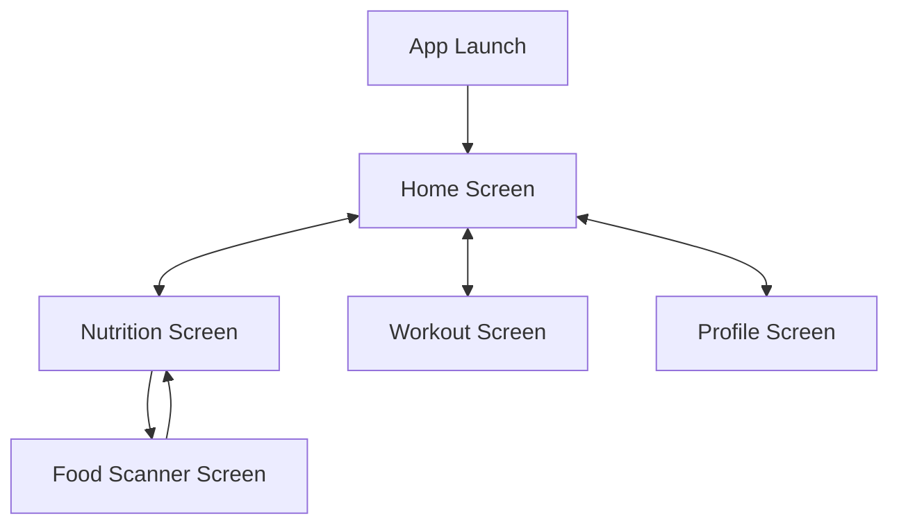
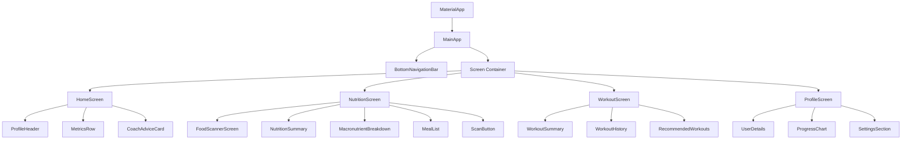

# Design Document

## Overview

This design document outlines the implementation approach for the LiveStyle application's initial screens based on the provided HTML mockups. The application will be built using Flutter with Material Design 3 principles, customized to match the specified design language. The implementation will focus on creating a responsive, user-friendly interface that displays health metrics, AI coach recommendations, and provides navigation between different app sections.

## Architecture

The application will follow a clean architecture pattern with separation of concerns:

1. **Presentation Layer**: Flutter widgets for UI components and screens
2. **Business Logic Layer**: State management and business logic
3. **Data Layer**: Models and dummy data providers

For this initial implementation, we will focus primarily on the presentation layer with dummy data, setting up the structure for future integration with real data sources.

### State Management

For this implementation, we will use a simple state management approach with StatefulWidgets and setState for local state. As the application grows, we can transition to a more robust solution like Provider or Bloc.

## Components and Interfaces

### Core Components

1. **AppTheme**: Custom theme configuration for colors, typography, and component styles
   - Primary color: #51946c (green)
   - Background color: #f8fbfa (off-white)
   - Text color: #0e1a13 (dark)
   - Font family: Manrope

2. **BottomNavigationBar**: Custom navigation bar with four tabs
   - Home (house icon)
   - Nutrition (carrot icon)
   - Workout (barbell icon)
   - Profile (user icon)

3. **MainApp**: Root widget that manages navigation between screens

### Screen Components

1. **HomeScreen**:
   - ProfileHeader: Displays user image, name, age, height, and goal
   - MetricsRow: Shows weight, BMI, and body fat percentage cards
   - CoachAdviceCard: Displays AI coach recommendations with image and text

2. **NutritionScreen**:
   - NutritionSummary: Displays daily calorie goals and consumption
   - MacronutrientBreakdown: Shows protein, carbs, and fat distribution
   - MealList: Displays meals logged for the day
   - ScanButton: Floating action button to access food scanner

3. **FoodScannerScreen**:
   - CameraView: Interface for capturing food images
   - AnalysisResults: Displays nutritional information after analysis
   - ConfirmationButtons: Options to confirm or retake the image

4. **WorkoutScreen**:
   - WorkoutSummary: Displays workout statistics
   - WorkoutHistory: Shows recent workout sessions
   - RecommendedWorkouts: Displays AI trainer recommendations

5. **ProfileScreen**:
   - UserDetails: Displays and allows editing of user information
   - ProgressChart: Shows weight loss progress over time
   - SettingsSection: Access to app settings and preferences

## Data Models

For the initial implementation with dummy data, we will create the following models:

1. **User**:
   ```dart
   class User {
     final String name;
     final String imageUrl;
     final int age;
     final String height;
     final String weightLossGoal;
     
     User({
       required this.name,
       required this.imageUrl,
       required this.age,
       required this.height,
       required this.weightLossGoal,
     });
   }
   ```

2. **HealthMetric**:
   ```dart
   class HealthMetric {
     final String name;
     final String value;
     final String change;
     final bool isPositiveChange;
     
     HealthMetric({
       required this.name,
       required this.value,
       required this.change,
       required this.isPositiveChange,
     });
   }
   ```

3. **CoachAdvice**:
   ```dart
   class CoachAdvice {
     final String coachType; // "nutritionist", "trainer", "therapist"
     final String title;
     final String description;
     final String imageUrl;
     
     CoachAdvice({
       required this.coachType,
       required this.title,
       required this.description,
       required this.imageUrl,
     });
   }
   ```

4. **NutritionData**:
   ```dart
   class NutritionData {
     final int calorieGoal;
     final int caloriesConsumed;
     final int proteinGrams;
     final int carbGrams;
     final int fatGrams;
     final List<Meal> meals;
     
     NutritionData({
       required this.calorieGoal,
       required this.caloriesConsumed,
       required this.proteinGrams,
       required this.carbGrams,
       required this.fatGrams,
       required this.meals,
     });
   }
   
   class Meal {
     final String name;
     final String imageUrl;
     final int calories;
     final String time;
     
     Meal({
       required this.name,
       required this.imageUrl,
       required this.calories,
       required this.time,
     });
   }
   ```

5. **WorkoutData**:
   ```dart
   class WorkoutData {
     final int weeklyWorkouts;
     final int totalMinutes;
     final int caloriesBurned;
     final List<Workout> recentWorkouts;
     
     WorkoutData({
       required this.weeklyWorkouts,
       required this.totalMinutes,
       required this.caloriesBurned,
       required this.recentWorkouts,
     });
   }
   
   class Workout {
     final String name;
     final String duration;
     final int caloriesBurned;
     final String date;
     
     Workout({
       required this.name,
       required this.duration,
       required this.caloriesBurned,
       required this.date,
     });
   }
   ```

## Screen Flow Diagram



## UI Component Hierarchy



## Error Handling

1. **Asset Loading Errors**: Implement fallback images and error states for when assets fail to load
2. **Navigation Errors**: Handle navigation edge cases and provide appropriate feedback
3. **Layout Overflow**: Ensure responsive design that adapts to different screen sizes and prevents layout issues

## Testing Strategy

1. **Widget Tests**:
   - Test individual UI components for proper rendering
   - Verify navigation between screens works correctly
   - Ensure bottom navigation bar highlights the correct tab

2. **Integration Tests**:
   - Test the flow between screens
   - Verify that dummy data is displayed correctly across the application

3. **Responsive Testing**:
   - Test on different screen sizes to ensure layouts adapt properly
   - Verify that components resize appropriately on different devices

## Implementation Considerations

1. **Font Integration**: 
   - Add Manrope font to the pubspec.yaml
   - Configure TextTheme in the app theme

2. **SVG Icons**:
   - Use flutter_svg package for custom icons
   - Create an IconProvider class to manage icon access

3. **Image Assets**:
   - Use network images for the initial implementation
   - Later, replace with local assets for better performance

4. **Responsive Design**:
   - Use LayoutBuilder and MediaQuery for responsive layouts
   - Implement different layouts for phone and tablet screens

5. **Accessibility**:
   - Ensure proper contrast ratios for text
   - Add semantic labels to important UI elements
   - Support screen readers with appropriate descriptions